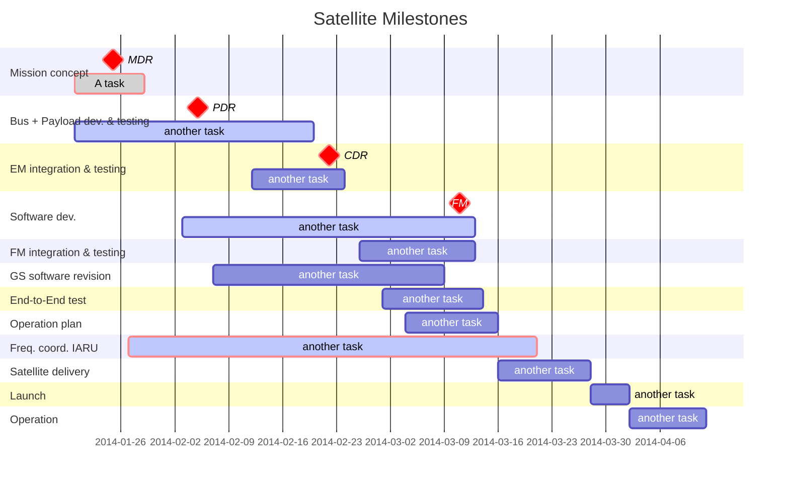

# Focus on making great missions
{: .no_toc }
Building a satellite can feel as complex as assembling a puzzle without a picture guide, but it doesn’t have to be. Build-A-Satellite simplifies nanosatellite development by providing comprehensive, user-friendly documentation for the customizable BIRDS cube satellite bus. Whether you're an experienced engineer or just stepping into the world of satellite technology, our resources break down the details and provide direct access to GitHub repositories, making your journey from idea to launch swifter than ever.

Note: The BIRDS project is the Joint Global Multi-Nations Satellite project. It was created by the Kyushu Institute of Technology (Kyutech) to help countries build their satellites.

[Get Started Now]({{site.url}}/get-started){: .btn .btn-purple }

Table of Contents

- Table of Contents
{:toc}

# *Background*
{: .no_toc }

## **Introduction**

This guide is your go-to resource for mastering the testing procedures of the BIRDS Bus subsystems. It is designed to help team members and collaborators confidently follow standardized steps, ensuring each subsystem operates reliably and efficiently. This document describes the details of launching a satellite from ideation to launch, including the purpose, structure, and practical workflows for testing key subsystems. This document does not describe ways of sourcing materials for building a nanosatellite.

Inside, you’ll find a clear breakdown of procedural guides for subsystems including the following:

* On-Board Computer (OBC)
* Electrical Power System (EPS)
* Attitude Determination and Control System (ADCS)
* Communications (COM)
* Structural framework of BIRDS satellites
Whether you're troubleshooting or optimizing performance, this guide provides everything you need to stay on track and achieve consistent results.

> We are creating an environment for sharing knowledge and ideas.

{: .no_toc }
To help you create your own open source satellite mission, we are building a library of resources that will cover the entire mission lifetime from start to finish. 

If you would want to contribute to, or work with the [BIRDS] community in order to assist in developing this solution, please contibute to the [our Discussions channel on Github] or [get in touch with us.]

## **Phases of a satellite development**
  The development and deployment of a satellite involve a series of carefully structured phases to ensure the mission's success. From initial concept discussions to final pre-launch verifications, these phases guide teams through designing, building, and testing the satellite to meet stringent space industry standards. 
    
  Each phase acts as a checkpoint to confirm that requirements are met and potential risks are mitigated. Here are the major phases in a satellite development:
  - Mission Definition Review (MDR)
  - Preliminary Design Review (PDR)
  - Critical Design Review (CDR)
  - Flight Readiness Review (FRR) 

## **The BIRDS bus**

Think of the satellite bus as the backbone of a satellite. It’s the central structure that houses the payload, the satellite’s main mission equipment, and all the scientific instruments needed for operation. Without the bus, the payload and components wouldn’t have the support or stability to function in space.

## **Components of the BIRDS bus**

  
&nbsp;
  

The BIRDS bus includes the following key components:

<li>
**On-Board Computer (OBC)**: Handles the satellite’s core computing needs.

**Electrical Power System (EPS)**: Manages power generation, storage, and distribution.

**Attitude Determination and Control System (ADCS)**: Controls satellite orientation and stability.

**Communications (COM)**: Oversees data transmission to and from the satellite. 

**Structure**: Designs and constructs the satellite’s physical frame.

**Payload**: Manages mission-specific instruments or sensors.

**Backplane (BPB)**: Integrates all the subsystems and allows transfer of power and data to each of them.
</li>

  
  

    
  
  

## **Tools used in the developmnent of a BIRDS satellite**

Here are the major tools used in the deevlopment of a BIRDS satellite:

<ul>
   - **Software**:
     - **Computer Aided Design (CAD) tools for design**: Fusion 360
     - **Simulation Tools**: Thermal desktop, STK for mission analysis
     - **Programming Languages**: C/C++, Python 
     - **Programming Environment**: CCS Compiler, MPLAB IDE
     - **Communication Protocols**: UART, SPI

   - **Hardware**:
     - **Microcontrollers/Boards**: PIC MCUs, custom PCBs
     - **Power Systems**: Solar panels, battery packs
     - **Sensing Devices**: Magnetometers, gyroscopes for ADCS
   - **Version Control**: Git/ [GitHub] 
</ul>
## [Getting Started]({{site.url}}/get-started){: .btn .btn-purple }
